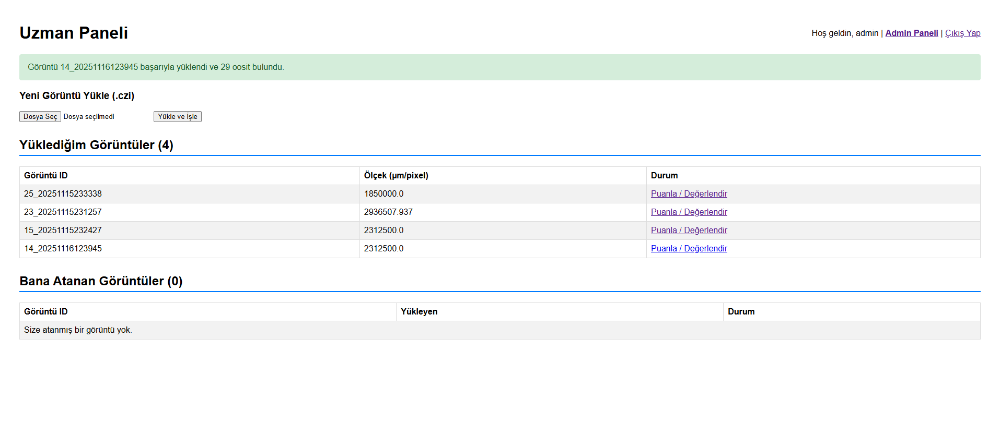
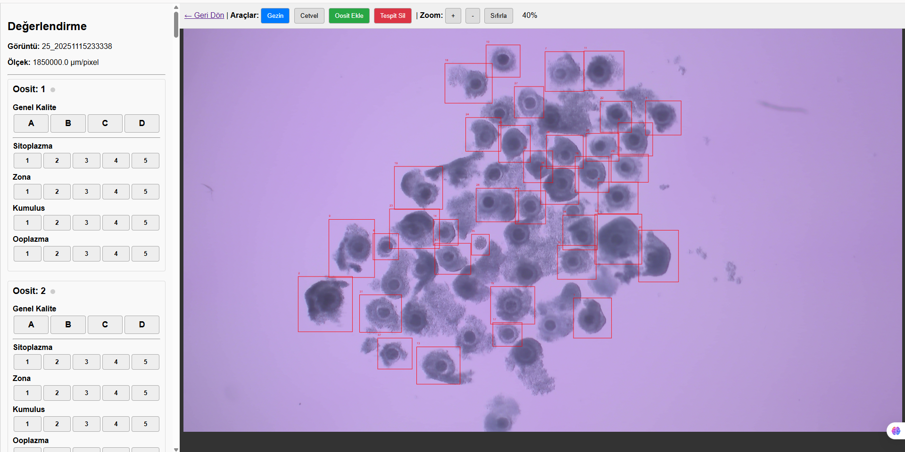
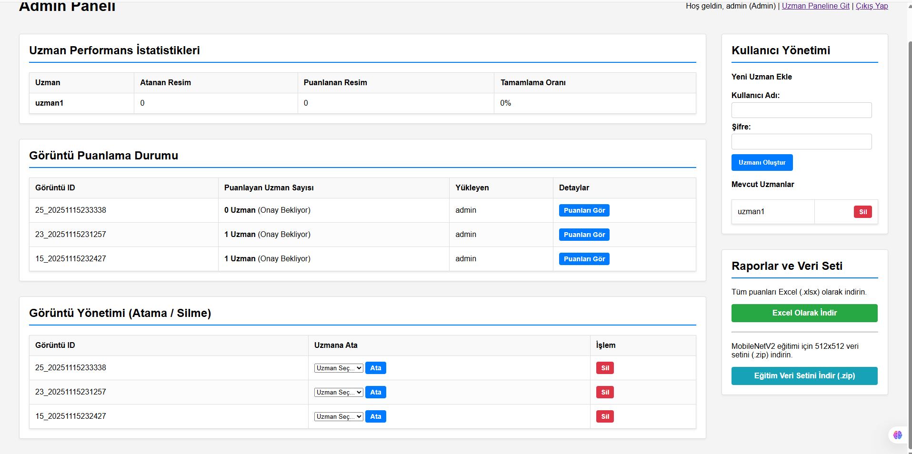
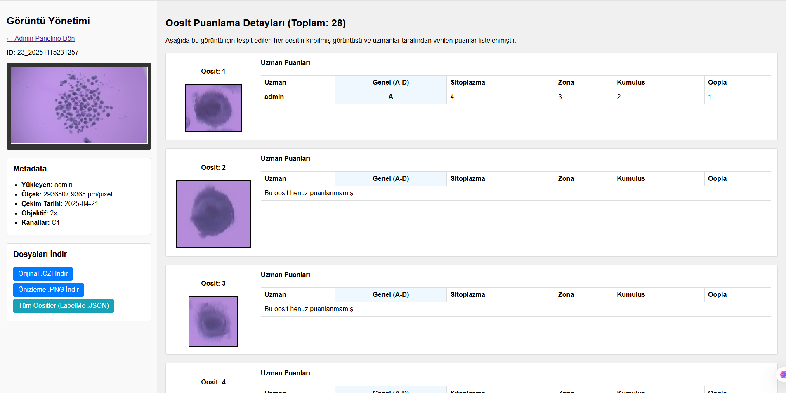

# 🧬 Oosit Kalite Değerlendirme Platformu

Bu proje, embriyologlar ve araştırmacılar için tasarlanmış yapay zekâ destekli (YOLOv8) bir **oosit kalite değerlendirme platformudur**.  
Sistem, **.czi (Zeiss)** formatındaki mikroskop görüntülerindeki oositleri otomatik olarak tespit eder ve uzmanların bu tespitleri **A-D sınıflandırması + 4 morfolojik kriter** ile puanlamasına olanak tanır.

Sistemin temel amacı, uzmanlardan toplanan yüksek kaliteli veriyi kullanarak **MobileNetV2** gibi modeller için  
**512x512, kare formatlı bir sınıflandırma veri seti oluşturmak** ve yapay zekâ modellerini eğitmektir.

---

## 🚀 Temel Özellikler

Platform iki ana kullanıcı rolünden oluşur:

- **🧑‍🔬 Uzman (Puanlama yapar)**
- **👑 Admin (Yönetim yapar)**

---

## 🧑‍🔬 Uzman Arayüzü (Puanlama & Düzeltme)

### 📁 .czi Dosya Desteği  
Zeiss mikroskop dosyalarını doğrudan yükleme ve işleme.

### 🤖 Otomatik Tespit (YOLOv8)
Yüklenen görüntüdeki oositlerin otomatik tespiti.

### 🔍 Gelişmiş Görüntüleme
- Pan (kaydırma)
- Zoom (yakınlaştırma)
- Canvas tabanlı inceleme

### 📏 Bilimsel Cetvel  
Görüntü metadata’sındaki ölçek bilgisine dayanarak **µm cinsinden doğru ölçüm** yapabilme.

### 📝 İki Aşamalı Puanlama  
1. **Genel Kalite:** A, B, C, D  
2. **Detaylı Morfoloji Puanları (1–5):**
   - Sitoplazma  
   - Zona  
   - Perivitellin Alan  
   - Kumulus (varsa)

### 🛠 İnsan Denetim Araçları
- **Oosit Ekle:** Eksik tespitleri manuel ekleme  
- **Tespit Sil:** Yanlış tespitleri kolayca kaldırma  

---

## 👑 Admin Paneli (Yönetim & Veri Çıktısı)

### 📊 İstatistik Paneli
- Uzmanlara atanmış görüntüler ve ilerleme yüzdeleri  
- Bir görüntünün kaç uzman tarafından puanlandığı (konsensüs analizi)

### 👤 Kullanıcı Yönetimi
- Yeni uzman ekleme  
- Uzman silme  

### 🖼 Görüntü Yönetimi
- Görüntüleri uzmanlara atama  
- Hatalı / eski görüntüleri tüm skorlarıyla birlikte sistemden silme  

### 📥 Detaylı İnceleme & İndirme
- `.czi` metadata görüntüleme (Objektif, kanallar vb.)  
- Orijinal `.czi`, işlenmiş `.png` ve **LabelMe JSON** indirme  
- Tespit edilmiş her oositin kırpılmış halini (cropped) görme  
- Tüm uzman puanlarını karşılaştırmalı tabloda inceleme  

### 📦 Veri Seti Oluşturma (Yapay Zekâ İçin)
- **Excel Raporu (.xlsx):** Tüm uzman puanları  
- **Sınıflandırma Seti (.zip):**
  - 512×512 pad edilmiş oosit görüntüleri  
  - `labels.csv`  
  - MobileNetV2 eğitimi için hazır içerik  

---

